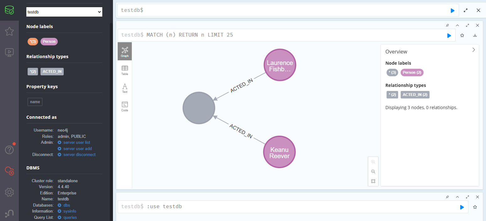

# Standalone.Neo4j.config

This project enables the use of a standalone graph database ([Neo4j](https://neo4j.com/)) and provides basic functionality. The Neo4j, the world's most-loved graph database.

# Prerequisite

- Need [Docker Desktop](https://www.docker.com/) 4.28.0 or higher
- (Optional) Need change parameters in file `.env`.

# Overview

The project showcases how to write data into the graph database Neo4j using an Neo4j server running locally. It includes the following applications:
- `Console` is responsible for create a database and some entities into database using [`Cyanide.Cypher`](https://www.nuget.org/packages/Cyanide.Cypher). Cypher query builder is a lightweight and intuitive C# library designed to construct Cypher queries programmatically for use with Neo4j graph database. It simplifies query creation by providing a fluent and type-safe API, allowing developers to focus on query logic rather than string concatenation. It’s connected using [`Neo4j.Driver`](https://www.nuget.org/packages/Neo4j.Driver). The official .NET driver for the Neo4j Graph Database over the Bolt protocol.

The following versions are available:
- [Neo4j 4.4](4.4/src/)
- [Neo4j 4.4.40 Enterprise](4.4/src/)

# How does it work?

- Run the `Neo4j` instance:
    - Navigate to the appropriate directory, e.g., `4.4\src\docker`;
    - Use the command:`docker compose up`;
    - The `Neo4j` server will be available at `http://localhost:7474/browser/` ( `4.4.40 Enterprise` edition ). __Note__: The `Community` Edition of Neo4j supports running a single database at a time. Additionally, the Community version does not include the capability to assign roles and permissions to users so those steps are not included in this tutorial.

- Run the solution:
  - Open the solution file, e.g., `4.4\Standalone.Neo4j.Solution.sln`;
  - Update `appsettings.Development.json`:
```json
    {
        "NeoSettings": {
            "BaseBoltAddress": "bolt://localhost:7687",
            "UserName": "neo4j",
            "Password": "*****"
        }
    }
```
  - Run project `Neo4j.v4.Console` in the solution

- The result should be the following:
```
    Connection to database testDb is verified.
    Query: CREATE DATABASE testDb IF NOT EXISTS
    Database testDb created.
    Query: CREATE (keanu:Person {name: 'Keanu Reeves'}), (laurence:Person {name: 'Laurence Fishburne'}), (keanu)-[:ACTED_IN]->(theMatrix), (laurence)-[:ACTED_IN]->(theMatrix)
    Persons are created into database testDb.
```

- The graph data should look like the following:



- The Cypher query can be built using `Cyanide.Cypher` and executed with `Neo4j.Driver`. See the example below:

```csharp
    // -------------------------- Driver initialization --------------------------
    // Get Neo4j client based on Neo4j.Driver
    using var neoClient = host.Services.GetRequiredService<INeoDriverClient>();

    // -------------------------- Connectivity --------------------------
    // Verify connectivity to the Neo4j server
    await neoClient.VerifyConnectivityAsync();
    Console.WriteLine($"Connection to database {dataBaseName} is verified.");

    // -------------------------- Create graph database instance --------------------------
    // Crete a new database. Do not use default and home database 'neo4j'
    // The query builder should generate the following administrative Cypher query:
    //
    //      CREATE DATABASE testDb IF NOT EXISTS
    //
    var createDbQuery = Factory.AdminQueryBuilder()
        .Create(q => q
            .WithDatabase(dataBaseName)
            .IfNotExists()
        ).Build();
    await neoClient.ExecuteQueryAsync(createDbQuery);
    Console.WriteLine($"Query: {createDbQuery}");
    Console.WriteLine($"Database {dataBaseName} created.");

    // -------------------------- Create entities --------------------------
    // Create some entities into database
    // The query builder should generate the following Cypher query:
    //
    //      CREATE (keanu:Person {name: 'Keanu Reeves'}), (laurence:Person {name: 'Laurence Fishburne'}), (keanu)-[:ACTED_IN]->(theMatrix), (laurence)-[:ACTED_IN]->(theMatrix)
    //
    // After that the query should be executed.
    var createPersonsQuery = Factory.QueryBuilder()
        .Create(q =>
            q.WithNode(new Entity("Person", "keanu", [new Field("name", "'Keanu Reeves'")]))
                .WithNode(new Entity("Person", "laurence", [new Field("name", "'Laurence Fishburne'")]))
                .WithRelation(new Entity("ACTED_IN", ""), RelationshipType.Direct, new Entity("keanu"),
                    new Entity("theMatrix"))
                .WithRelation(new Entity("ACTED_IN", ""), RelationshipType.Direct, new Entity("laurence"),
                    new Entity("theMatrix"))
        ).Build();
    await neoClient.ExecuteQueryAsync(createPersonsQuery, dataBaseName);
    Console.WriteLine($"Query: {createPersonsQuery}");
    Console.WriteLine($"Persons are created into database {dataBaseName}.");
```

# References

- [Deploy a Neo4j standalone server using Docker Compose](https://neo4j.com/docs/operations-manual/4.4/docker/docker-compose-standalone/)
- [Modify the default configuration](https://neo4j.com/docs/operations-manual/4.4/docker/configuration/)
- [Get started with Neo4j in Docker](https://neo4j.com/docs/operations-manual/4.4/docker/introduction/)
- [Neo4j Bolt Driver 5.27 for .NET](https://neo4j.com/docs/api/dotnet-driver/current/api/Neo4j.Driver.html)